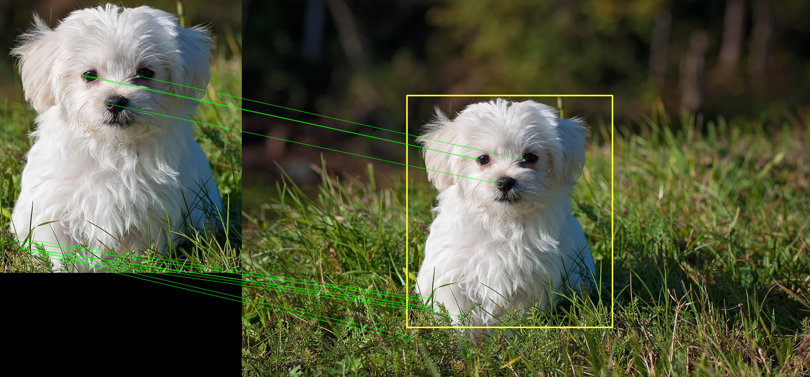

# homography-transformation-python

This repository is created to perform homography transformation between two images, including shifting, rescaling and rotation.

Can be used in many cases, while we focus more on a specific case of only cropping(shifting) from original image and then rescaling.

****
Required config(can be changed in config.py):

* **ROOT_PATH**: root path of the input and output images
* **SEARCH_RADIUS**: radius of searcing for best start and end point
* **MIN_MATCH_PAIRS**: min match pairs needed for calculation

****
Required: python3, cv2

**Output**: 

`query_keypoints.jpg`: keypoints of query image

`train_keypoints.jpg`: keypoints of train image

`features_matching.jpg`: features matching and localization of query and train image

`result.jpg`: calculate query image from train image, should be the same as the old query image

****
How to run: 
* Edit config.py for any paths/settings
* run `python main.py`

